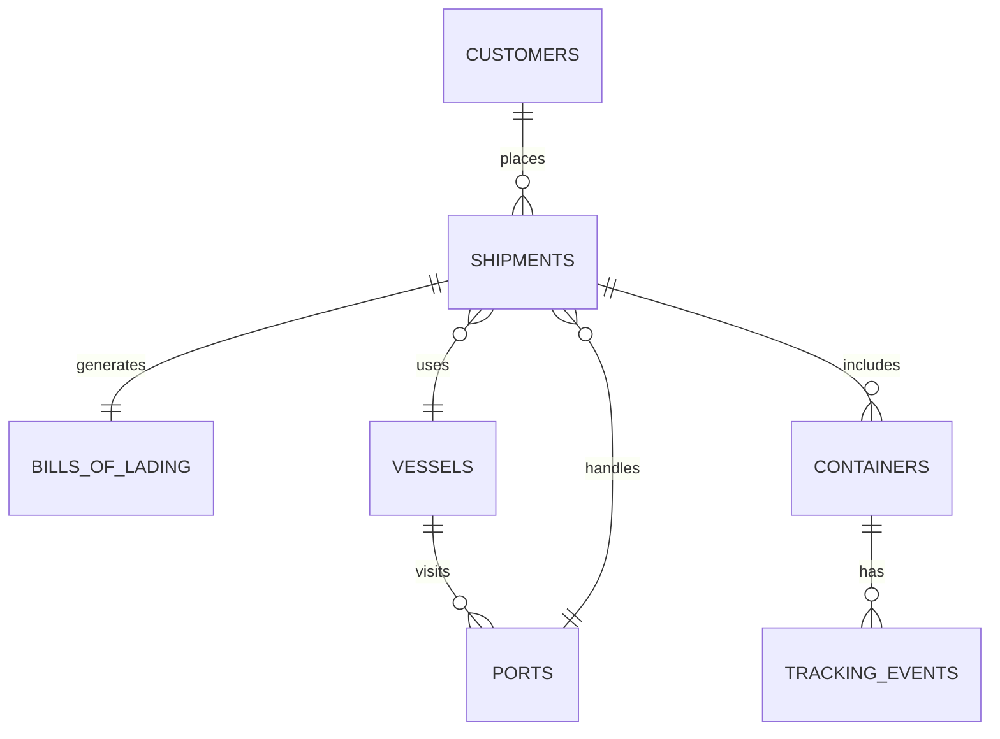

# Synthetic Big Data Shipping Dataset Generator

This project generates realistic synthetic ocean freight data for data lakes,
warehouses, ETL tests, ML experiments, shipment visibility platforms, logistics
control towers, and port operations analytics.

The generator writes each table as a separate physical dataset. `--records`
means shipment count; containers and tracking events are derived from shipments.

## Project Motivation

Public logistics datasets are often small, incomplete, outdated, or lack the
complex relationships required for modern Data Engineering, Analytics, and
Machine Learning workloads.

This project generates realistic large-scale ocean freight datasets with
business relationships, operational events, delays, congestion, customs risk,
and data quality anomalies for:

- Data Engineering projects
- Data Warehouse testing
- ETL/ELT pipeline validation
- Analytics Engineering
- Machine Learning experimentation
- Supply Chain and Logistics simulations



## Scale

The generator can produce:

| Shipments | Tracking Events | Containers |
|------------|------------|------------|
| 1 Million | ~5–15 Million | ~1–3 Million |
| 10 Million | ~50–150 Million | ~10–30 Million |
| 100 Million | ~500M+ | ~100M+ |

## Example Use Cases

- Apache Spark performance testing
- BigQuery optimization exercises
- Snowflake warehouse benchmarking
- dbt transformation projects
- Data quality validation frameworks
- Supply chain analytics dashboards
- Shipment delay prediction models
- Customs risk scoring experiments

## Technology Stack

- Python
- Pandas
- NumPy
- PyArrow
- Parquet
- Multiprocessing

## Quick Start

```powershell
py -m pip install -r requirements.txt
py .\generate_shipping_data.py --records 1000000 --chunk-size 100000 --workers 8 --output-dir output
```

For CSV instead of Parquet:

```powershell
py .\generate_shipping_data.py --records 10000 --format csv --output-dir output_csv
```

## Output Layout

```text
output/
  ports.parquet
  vessels.parquet
  customers.parquet
  containers/
    part-0001.parquet
    part-0002.parquet
  bills_of_lading/
    part-0001.parquet
    part-0002.parquet
  shipments/
    part-0001.parquet
    part-0002.parquet
  tracking_events/
    part-0001.parquet
    part-0002.parquet
```

## 📦 Core Tables

### 🚢 `ports`
Major global ports across China, Singapore, UAE, India, Europe, the US, Latin America, and Africa.

| Column | Type |
|--------|------|
| `port_id` | PK |
| `port_name` | |
| `un_locode` | UN/LOCODE |
| `country` | |
| `region` | |
| `latitude` | |
| `longitude` | |

---

### 🚢 `vessels`
Synthetic carrier fleet with realistic container vessel capacity bands.

| Column | Type |
|--------|------|
| `vessel_id` | PK |
| `vessel_name` | |
| `imo_number` | Unique |
| `carrier` | |
| `vessel_type` | |
| `teu_capacity` | TEUs |
| `build_year` | |
| `flag_country` | |

---

### 👥 `customers`
Global shippers, consignees, freight forwarders, and NVOCCs.

| Column | Type |
|--------|------|
| `customer_id` | PK |
| `company_name` | |
| `customer_type` | e.g., shipper, forwarder |
| `country` | |
| `industry` | |

---

### 📄 `bills_of_lading`
Master and house Bill of Lading records with booking and freight terms.

| Column | Type |
|--------|------|
| `bl_number` | PK |
| `master_bl_number` | FK to self |
| `house_bl_number` | |
| `booking_number` | |
| `issue_date` | |
| `carrier` | |
| `shipper_id` | FK → `customers` |
| `consignee_id` | FK → `customers` |
| `freight_terms` | e.g., prepaid, collect |

---

### 📦 `shipments`
**Central fact table** – route, vessel, cargo, delays, congestion, customs risk, and seasonal analytics.

| Column | Description |
|--------|-------------|
| `shipment_id` | PK |
| `bl_number` | FK → `bills_of_lading` |
| `vessel_id` | FK → `vessels` |
| `voyage_number` | |
| `origin_port` | FK → `ports` |
| `destination_port` | FK → `ports` |
| `transshipment_port` | FK → `ports` (optional) |
| `departure_date` | |
| `eta` | |
| `actual_arrival_date` | |
| `shipment_status` | |
| `commodity` | |
| `hs_code` | |
| `cargo_description` | |
| `package_count` | |
| `package_type` | |
| `declared_value` | |
| `currency` | |
| `planned_transit_days` | |
| `actual_transit_days` | |
| `delay_days` | Derived |
| `port_congestion_score` | 0–100 |
| `weather_delay_days` | |
| `customs_risk_score` | 0–100 |
| `peak_season_indicator` | Boolean |
| `anomaly_flag` | Boolean |

---

### 🧳 `containers`
ISO 6346-compliant container data – weights, seals, hazard flags, utilization.

| Column | Description |
|--------|-------------|
| `container_number` | PK |
| `shipment_id` | FK → `shipments` |
| `bl_number` | FK → `bills_of_lading` |
| `container_type` | e.g., dry, reefer, tank |
| `container_size` | e.g., 20ft, 40ft |
| `tare_weight_kg` | |
| `cargo_weight_kg` | |
| `gross_weight_kg` | |
| `seal_number` | |
| `hazardous_indicator` | Boolean |
| `container_status` | |
| `utilization_ratio` | cargo / max capacity |

---

### ⏱️ `tracking_events`
Lifecycle events per shipment/container.  
> ⚠️ Clean records are **chronological**; anomalies may have missing or out-of-order events.

| Column | Description |
|--------|-------------|
| `event_id` | PK |
| `shipment_id` | FK → `shipments` |
| `container_number` | FK → `containers` |
| `event_type` | e.g., departure, arrival, customs hold |
| `event_timestamp` | |
| `event_location` | port code or lat/lon |
| `event_location_name` | |
| `event_status` | |

---

## ERD Description

```text
customers.customer_id 1--N bills_of_lading.shipper_id
customers.customer_id 1--N bills_of_lading.consignee_id
bills_of_lading.bl_number 1--N shipments.bl_number
vessels.vessel_id 1--N shipments.vessel_id
ports.un_locode 1--N shipments.origin_port
ports.un_locode 1--N shipments.destination_port
ports.un_locode 1--N shipments.transshipment_port
shipments.shipment_id 1--N containers.shipment_id
bills_of_lading.bl_number 1--N containers.bl_number
shipments.shipment_id 1--N tracking_events.shipment_id
containers.container_number 1--N tracking_events.container_number
ports.un_locode 1--N tracking_events.event_location
```

## Realism Model

The generator includes weighted trade lanes such as Shanghai to Singapore,
Shanghai to Rotterdam, Ningbo to Los Angeles, Shenzhen to Hamburg, Singapore to
Jebel Ali, India to Rotterdam, US East Coast to Europe, Latin America exports,
and Africa import/export routes.

It simulates peak season, holiday demand changes, congestion, weather delay,
customs inspections, vessel schedule changes, transshipment dwell time, ETA
variance, container utilization, commodity-specific hazardous probability, and
customs risk.

By default, about 95% of records are clean and 5% contain anomalies such as
missing seals, duplicate B/L numbers, missing ETA, incorrect weights, delayed
arrival, missing tracking events, out-of-order event sequences, or invalid
customs statuses.

## Sample Records

Generate a tiny sample:

```powershell
py .\generate_shipping_data.py --records 25 --chunk-size 25 --workers 1 --customers 100 --vessels 20 --output-dir sample_output
```

Read a table:

```python
import pandas as pd

print(pd.read_parquet("sample_output/ports.parquet").head())
print(pd.read_parquet("sample_output/shipments/part-0001.parquet").head())
print(pd.read_parquet("sample_output/tracking_events/part-0001.parquet").head())
```

If PyArrow is not installed in a lightweight environment, use `--format csv`
for the sample run and read the `.csv` files instead.

Example rows:

```text
ports:
PORT-CNSHA, Shanghai, CNSHA, China, East Asia, 31.2304, 121.4737

vessels:
VES-000001, Ever Horizon 001, IMO9962545, CMA CGM, Container Ship, 1800, 2024, Denmark

customers:
CUS-00000001, Noble Retail 000001 BV, Consignee, India, Automotive

bills_of_lading:
ONE00000000001, ONE00000000001, null, BKG0000000001X, 2022-10-02, Ocean Network Express, CUS-00000006, CUS-00000054, Prepaid

shipments:
SHP-000000000001, ONE00000000001, VES-000008, 2241U37, MACAS, ESALG, null, 2022-10-13, 2022-10-14, 2022-10-19, Delivered, Furniture, 940360

containers:
TOEU5119314, SHP-000000000001, ONE00000000001, Reefer, 40, 4746, 20596, 25342, SLIQU9KMG9KE, false, Delivered, 0.858

tracking_events:
EVT-000000000001-TOEU5119314-01, SHP-000000000001, TOEU5119314, Booking Confirmed, 2022-09-10 00:00:00, MACAS, Casablanca, Completed
```

## Future Improvements

- Air freight dataset support
- Rail freight support
- Real-time event stream generation
- Kafka integration
- Iceberg/Delta Lake output
- Synthetic customs declarations
- Port call event generation

## Performance Recommendations For 100M+ Records

Use Parquet with Snappy or Zstandard compression, keep `--chunk-size` between
250,000 and 2,000,000 shipments depending on RAM, and write to fast local NVMe or
directly to object storage through a staged filesystem. Increase `--workers` only
until disk throughput saturates.

For very large runs, generate dimensions once, then run separate non-overlapping
shipment ranges by changing seeds and output prefixes per job. Keep part files in
the 128 MB to 1 GB range for Spark, Trino, Snowflake external tables, BigQuery
external tables, and lakehouse engines. Partition downstream by `departure_date`,
`origin_port`, or `carrier` rather than producing millions of tiny generator
files.

Validate large outputs with row-count checks, foreign-key joins on a sample,
event chronology checks on clean records, and aggregate distributions for lanes,
delay days, utilization, and anomaly rate.

Designed using real-world logistics, customs, freight forwarding,
container shipping, and port operations concepts.
